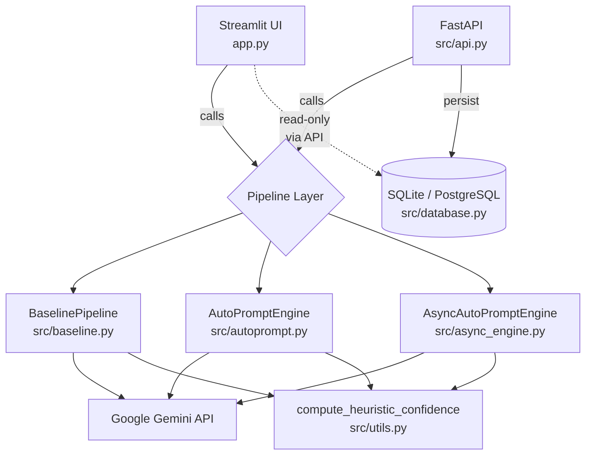
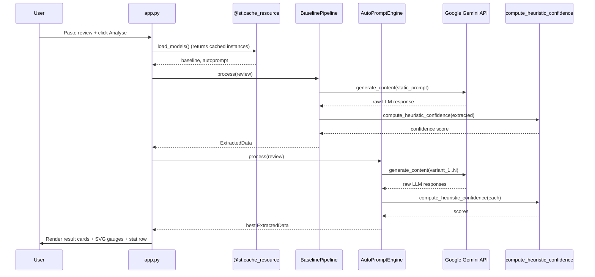
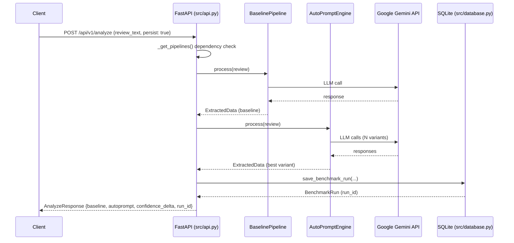
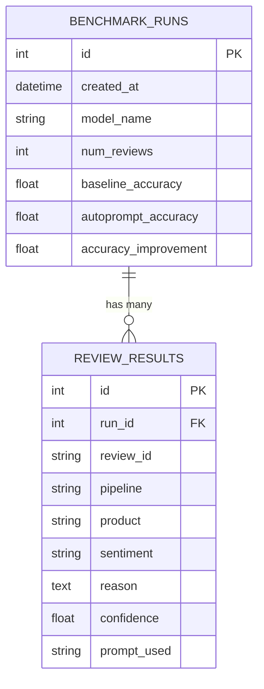

# Architecture — AutoPrompt

This document describes the technical architecture of AutoPrompt: how its components are structured, how they interact, and the design decisions behind them.

---

## Table of Contents

- [System Overview](#system-overview)
- [Component Responsibilities](#component-responsibilities)
- [Request Flow — Streamlit UI](#request-flow--streamlit-ui)
- [Request Flow — REST API](#request-flow--rest-api)
- [Confidence Scoring](#confidence-scoring)
- [Async Engine](#async-engine)
- [Database Design](#database-design)
- [Configuration System](#configuration-system)
- [Design Decisions](#design-decisions)

---

## System Overview

AutoPrompt has two independent client surfaces — a **Streamlit UI** and a **FastAPI REST API** — that share the same underlying pipeline layer, confidence scorer, and persistence store.



---

## Component Responsibilities

### `app.py` — Streamlit UI

- **Responsibility:** Render the interactive demo. No business logic.
- **Design system:** Custom "Abyss Violet" CSS injected via `st.markdown(..., unsafe_allow_html=True)`.
- **Render functions:** `render_hero`, `render_sidebar`, `render_input`, `render_loading`, `render_card`, `render_stats`, `render_empty`, `render_error`, `render_footer`.
- **Caching:** `@st.cache_resource` on `load_models()` — pipelines are initialised once and reused across reruns.
- **SVG gauges:** Half-donut arcs generated server-side via `_gauge()`, embedded as inline SVG.

---

### `src/api.py` — FastAPI REST API

- **Responsibility:** Expose HTTP endpoints for programmatic access. Thin controller layer.
- **Startup:** `@app.on_event("startup")` initialises the DB schema and loads both pipelines into a module-level dict (`_pipelines`).
- **Dependency injection:** `_get_pipelines()` and `db_session()` are FastAPI `Depends` dependencies.
- **All Pydantic schemas** use `v2` style; responses are `response_model`-typed on every route.

---

### `src/baseline.py` — Baseline Pipeline

- **Responsibility:** Run a single, fixed, hand-crafted prompt against the Gemini API and parse the structured response.
- **Interface:** `BaselinePipeline.process(review: Review) -> ExtractedData`
- **Key characteristic:** Deterministic prompt — same review always gets the same prompt template.

---

### `src/autoprompt.py` — AutoPrompt Engine

- **Responsibility:** Generate N prompt variants dynamically, run each against the Gemini API, score all responses with the shared confidence heuristic, and return the best result.
- **Interface:** `AutoPromptEngine.process(review: Review) -> ExtractedData`
- **Key characteristic:** Non-deterministic at the prompt-generation level; deterministic at the scoring level.

---

### `src/async_engine.py` — Async AutoPrompt Engine

- **Responsibility:** Async-native version of `AutoPromptEngine` for high-throughput batch scenarios.
- **Interface:** `AsyncAutoPromptEngine.process(review: Review) -> ExtractedData` (async)
- **Concurrency model:** `asyncio.gather()` over all variant LLM calls — all N calls are in-flight simultaneously.
- **Use case:** `POST /api/v1/analyze/batch` (planned) and the CLI batch runner in `main.py`.

---

### `src/utils.py` — Shared Utilities + Data Models

- **Responsibility:** Define the canonical data models and shared confidence heuristic.
- **`Review`** — input model: `review_id: str`, `review_text: str`
- **`ExtractedData`** — output model: `review_id`, `product`, `sentiment`, `reason`, `confidence`, `prompt_used`
- **`compute_heuristic_confidence(data: ExtractedData) -> float`** — Shared between all pipelines. Evaluates extraction completeness, sentiment validity, reason quality, and field consistency.

> The heuristic is deliberately **shared** so confidence scores are directly comparable between Baseline and AutoPrompt.

---

### `src/database.py` — Persistence Layer

- **Responsibility:** SQLAlchemy ORM models, session management, and repository helpers.
- **ORM models:** `BenchmarkRun`, `ReviewResult`
- **Session pattern:** `get_db()` context manager — commits on success, rolls back on exception.
- **Repository functions:** `save_benchmark_run`, `list_benchmark_runs`, `get_run_results`

---

### `src/config_loader.py` — Configuration

- **Responsibility:** Load YAML config from `config/` and apply environment variable overrides.
- **Output:** A plain `dict` consumed by pipeline constructors.

---

### `src/evaluator.py` — Evaluator

- **Responsibility:** Batch evaluation utilities for `main.py` — compare pipeline outputs against ground-truth labels.

---

## Request Flow — Streamlit UI



---

## Request Flow — REST API



---

## Confidence Scoring

The `compute_heuristic_confidence` function produces a `float` in `[0.0, 1.0]`. It is **identical** for both pipelines — no scoring advantage is given to AutoPrompt.

**Scoring dimensions:**

| Dimension | Signal |
|---|---|
| Extraction completeness | Are `product`, `sentiment`, `reason` all non-empty? |
| Sentiment validity | Is `sentiment` one of `positive / negative / neutral / mixed`? |
| Reason quality | Minimum length, keyword presence, specificity |
| Field agreement | Internal consistency between product name and reason text |

**Score thresholds (approximate):**

| Score range | Interpretation |
|---|---|
| `0.9 – 1.0` | High confidence, complete structured extraction |
| `0.7 – 0.9` | Good extraction, minor gaps |
| `0.5 – 0.7` | Partial extraction, low specificity |
| `< 0.5` | Failed or near-empty extraction |

---

## Async Engine

`AsyncAutoPromptEngine` is the async-native counterpart of `AutoPromptEngine`.

```python
# Concurrent calls to Gemini for all N variants
results = await asyncio.gather(*[
    self._call_gemini(variant, review)
    for variant in prompt_variants
])
```

**When to use:**
- Batch CLI runs (`main.py`) with many reviews
- Planned `POST /api/v1/analyze/batch` endpoint
- Any context where throughput matters more than latency of a single call

**When to use the sync engine:**
- Single-request API calls (`POST /api/v1/analyze`)
- Streamlit UI (Streamlit's threading model does not support `asyncio.run()` reliably)

---

## Database Design



**Design decisions:**
- `benchmark_runs` stores denormalised summary metrics (`baseline_accuracy`, `autoprompt_accuracy`) for fast dashboard queries without aggregation.
- `review_results.pipeline` is a discriminator string (`"baseline"` or `"autoprompt"`) rather than a foreign key — keeps queries simple.
- SQLite is default; swap to PostgreSQL by setting `DATABASE_URL=postgresql://...`. No migrations needed for initial schema (SQLAlchemy `create_all`).

---

## Configuration System

Pipeline configuration lives in YAML files under `config/`. The loader merges file config with environment variable overrides:

```python
config = load_secure_config()
# Returns a dict, e.g.:
# {
#   "generator_model": "gemini-1.5-flash",
#   "num_variants": 4,
#   "temperature": 0.7,
#   ...
# }
```

Environment variables take precedence over YAML values. Pipeline constructors accept the config dict directly — no global state.

---

## Design Decisions

| Decision | Rationale |
|---|---|
| Shared confidence heuristic | Ensures a fair comparison — AutoPrompt cannot win by having a more lenient scorer |
| Sync + async engines | Sync for simplicity in UI/single-API contexts; async for throughput in batch scenarios |
| SQLite default | Zero infrastructure — works locally and on Streamlit Cloud; swappable via one env var |
| Thin controllers | FastAPI routes delegate to pipeline classes immediately — no business logic in `api.py` |
| CSS-in-Python for Streamlit | Streamlit's theming system is limited; injecting CSS directly gives full design control |
| Pydantic v2 everywhere | Faster validation, better error messages, first-class `model_dump()` serialisation |
| `@st.cache_resource` for models | Prevents re-initialising Gemini clients on every Streamlit rerun |
